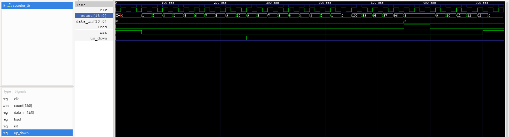

# Práctica 3: Contador Ascendente y Descendente con Load y Reset

## BCD_module.v

Este módulo convierte un dígito BCD (0–9) a su representación en display de 7 segmentos.

```verilog
module BCD_module (

	input  [3:0] bcd_in,
	output reg [6:0] bcd_out

);

	always @(*) 
		begin
			case (bcd_in)
				4'b0000:bcd_out = ~7'b1111110;
				4'b0001:bcd_out = ~7'b0110000;
				4'b0010:bcd_out = ~7'b1101101;
				4'b0011:bcd_out = ~7'b1111001;
				4'b0100:bcd_out = ~7'b0110011;
				4'b0101:bcd_out = ~7'b1011011;
				4'b0110:bcd_out = ~7'b1011111;
				4'b0111:bcd_out = ~7'b1110000;
				4'b1000:bcd_out = ~7'b1111111;
				4'b1001:bcd_out = ~7'b1111011;
				default:bcd_out = ~7'b0000000;
			endcase
		end
	
endmodule
```

---

## BCD_4Displays.v

El módulo recibe el valor del contador y lo separa en unidades, decenas, centenas y millares para mostrarlos en los displays.

```verilog
module BCD_4Displays #(parameter N_in = 14, N_out = 7) (

    input [N_in - 1:0] bcd_in,
    output [N_out - 1:0] D_un, D_de, D_ce, D_mi,
    output [3:0] unidades, decenas, centenas, millares
    
);

    assign unidades = bcd_in % 10;
    assign decenas = (bcd_in / 10) % 10;
    assign centenas = (bcd_in / 100) % 10;
    assign millares = (bcd_in / 1000) % 10;

    BCD_module Unidades (
        .bcd_in(unidades), 
        .bcd_out(D_un)
    );

    BCD_module Decenas (
        .bcd_in(decenas), 
        .bcd_out(D_de)
    );

    BCD_module Centenas (
        .bcd_in(centenas), 
        .bcd_out(D_ce)
    );

    BCD_module Millares (
        .bcd_in(millares), 
        .bcd_out(D_mi)
    );

endmodule
```

---

## counter_wr.v

El módulo wrapper conecta los botones, switches y reloj de la FPGA con el sistema del contador.  
Incluye divisor de frecuencia, contador y módulo de visualización en displays de 7 segmentos.

```verilog
module counter_wr (

    input MAX10_CLK1_50,
    input [1:0] KEY,
    input [13:0] SW,

    output [0:6] HEX0,
    output [0:6] HEX1,
    output [0:6] HEX2,
    output [0:6] HEX3

);

    wire rst;
    wire load;
    wire up_down;
    wire slow_clk;
    wire [13:0] data_in;
    wire [13:0] count_value;

    assign rst = ~KEY[0];
    assign load = ~KEY[1];
    assign up_down = SW[13];
    assign data_in = SW;

    clock_divider #(.FREQ(1)) clk_div (
        .clk(MAX10_CLK1_50), 
        .rst(rst), 
        .clk_div(slow_clk)
    );

    counter #(.CMAX(100)) counter (
        .clk(slow_clk), 
        .rst(rst), 
        .load(load), 
        .up_down(up_down), 
        .data_in(data_in), 
        .count(count_value)
    );

    BCD_4Displays display (
        .bcd_in(count_value), 
        .D_un(HEX0), 
        .D_de(HEX1), 
        .D_ce(HEX2), 
        .D_mi(HEX3)
    );

endmodule
```

---

## clock_divider.v

El módulo divisor de frecuencia reduce la señal de 50 MHz de la FPGA a una frecuencia más baja para poder visualizar el conteo en los displays.

```verilog
module clock_divider #(parameter FREQ = 1) (

    input clk,
    input rst,
    output reg clk_div

);

    parameter CLK_FREQ = 50000000;
    parameter COUNT_MAX = (CLK_FREQ / (2 * FREQ));

    reg [31:0] count;

    always @(posedge clk)
        begin
            if (rst == 1'b1)
                begin
                    count <= 32'b0;
                end
            else if (count == COUNT_MAX - 1)
                begin
                    count <= 32'b0;
                end
            else
                begin
                    count <= count + 1;
                end
        end

    always @(posedge clk)
        begin
            if (rst == 1'b1)
                begin
                    clk_div <= 1'b0;
                end
            else if (count == COUNT_MAX - 1)
                begin
                    clk_div <= ~clk_div;
                end
        end

endmodule
```

---

## counter.v

El módulo contador permite contar de manera ascendente o descendente dependiendo del switch `up_down`.  
Incluye botón de `reset` para reiniciar a 0 y botón `load` para cargar un valor inicial.

```verilog
module counter #(parameter CMAX = 100) (

    input clk,
    input rst,
    input load,
    input up_down,
    input [13:0] data_in,
    output reg [13:0] count

);

    always @(posedge clk)
        begin
            if (rst)
                begin
                    count <= 0;
                end
            else if (load)
                begin
                    count <= data_in;
                end
            else if (up_down)
                begin
                    if (count == CMAX)
                        count <= 0;
                    else
                        count <= count + 1;
                end
            else
                begin
                    if (count == 0)
                        count <= CMAX;
                    else
                        count <= count - 1;
                end
        end

endmodule
```

---

## counter_tb.v

El testbench verifica el funcionamiento del contador probando reset, conteo ascendente, descendente y carga de datos.

```verilog
module counter_tb();

    reg clk;
    reg rst;
    reg load;
    reg up_down;
    reg [13:0] data_in;
    wire [13:0] count;

    counter #(.CMAX(100)) dut(
        .clk(clk),
        .rst(rst),
        .load(load),
        .up_down(up_down),
        .data_in(data_in),
        .count(count)
    );

    initial 
        begin
            clk = 0;
            forever #10 clk = ~clk;
        end

    initial 
        begin
            $display("Reset");
            rst = 1; load = 0; up_down = 1; data_in = 0; #50;
            rst = 0;

            $display("Subiendo");
            #200;

            $display("Bajando");
            up_down = 0;
            #300;

            $display("Load con el valor 8");
            load = 1; data_in = 14'd8; #50;
            load = 0;

            $display("Subiendo");
            up_down = 1;
            #100;

            $display("Reset");
            rst = 1; #50;

            $stop;
            $finish;
        end

    initial 
        begin
            $monitor("rst = %b, load = %b | up_down = %b | count = %d", rst, load, up_down, count);
        end

    initial 
        begin
            $dumpfile("counter_tb.vcd");
            $dumpvars(0, counter_tb);
        end

endmodule
```

---

## Testbench


---

## Simulación del testbench



---

## RTL


---

## Prueba en la tarjeta FPGA

[Ver video de la prueba](Counter.mp4)
