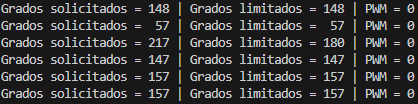
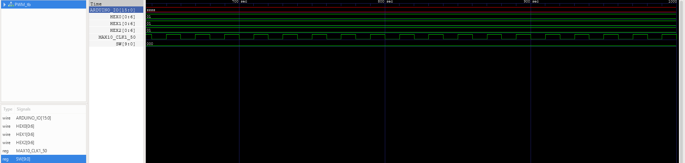

# Práctica 5: PWM

## PWM.v

Este módulo implementa un generador de **PWM (Pulse Width Modulation)** para controlar el ángulo de un servo utilizando los switches de la FPGA.  
El valor ingresado en los switches representa el **grado del servo (0° a 180°)**. Si el valor supera 180, se limita automáticamente.  
El sistema también muestra el valor del ángulo en **tres displays de 7 segmentos**.

```verilog
module PWM (

    input MAX10_CLK1_50,
    input [9:0] SW,

    output [15:0] ARDUINO_IO,
    output [0:6] HEX0,
    output [0:6] HEX1,
    output [0:6] HEX2

);

    wire rst = SW[0];
    wire [7:0] grado_raw = SW[8:1];

    reg [7:0] grado;

    wire [3:0] uni;
    wire [3:0] dec;
    wire [3:0] cen;

    always @(*)
        begin
            if (grado_raw > 8'd180)
                grado = 8'd180;
            else
                grado = grado_raw;
        end

    wire clk_div;
    reg [18:0] count = 0;
    wire [18:0] duty;
    wire arduino;

    parameter maxCount = 500000;

    clock_divider #(.FREQ(25000000)) clkdiv (
        .clk(MAX10_CLK1_50),
        .rst(rst),
        .clk_div(clk_div)
    );

    assign duty = 25000 + (grado * 25000) / 180;

    always @(posedge clk_div or posedge rst)
        begin
            if (rst)
                count <= 0;
            else if (count >= maxCount)
                count <= 0;
            else
                count <= count + 1;
        end

    assign arduino = (count < duty);
    assign ARDUINO_IO[0] = arduino;

    assign uni = grado % 10;
    assign dec = (grado / 10) % 10;
    assign cen = (grado / 100) % 10;

    BCD_module d0 (
        .bcd_in(uni), 
        .bcd_out(HEX0)
    );

    BCD_module d1 (
        .bcd_in(dec), 
        .bcd_out(HEX1)
    );

    BCD_module d2 (
        .bcd_in(cen), 
        .bcd_out(HEX2)
    );

endmodule
```

---

## PWM_tb.v

El **testbench** se utiliza para verificar el funcionamiento del generador PWM.  
Se simula el reloj de 50 MHz, se aplica un reset inicial y posteriormente se prueban distintos valores de ángulo generados aleatoriamente.

```verilog
module PWM_tb ();

    //Señales de entrada
    reg MAX10_CLK1_50;
    reg [9:0] SW;

    //Señales de salida
    wire [15:0] ARDUINO_IO;
    wire [0:6] HEX0;
    wire [0:6] HEX1;
    wire [0:6] HEX2;

    //Instancia del módulo
    PWM PWM (
        .MAX10_CLK1_50(MAX10_CLK1_50),
        .SW(SW),
        .ARDUINO_IO(ARDUINO_IO),
        .HEX0(HEX0),
        .HEX1(HEX1),
        .HEX2(HEX2)
    );

    initial
        begin
            MAX10_CLK1_50 = 0;
            SW = 10'b0;
        end

    always
        #10 MAX10_CLK1_50 = ~MAX10_CLK1_50;

    initial
        begin
            $display("Simulacion iniciada");

            #30;

            SW[0] = 1;
            #20;
            SW[0] = 0;

            #1000;

            repeat(6)
                begin
                    SW[8:1] = $random % 200;
                    #2000000;

                    $display("Grados solicitados = %d | Grados limitados = %d | PWM = %b", SW[8:1], PWM.grado, ARDUINO_IO[0]);
                end

            $stop;
            $finish;
        end

    initial
        begin
            $dumpfile("PWM_tb.vcd");
            $dumpvars(0, PWM_tb);
        end

endmodule
```

---

## clock_divider.v

Este módulo divide la frecuencia del reloj de la FPGA para generar un reloj más lento que pueda ser utilizado por otros módulos del sistema.

```verilog
module clock_divider #(parameter FREQ = 1) (

    input clk,
    input rst,
    output reg clk_div

);

    parameter CLK_FREQ = 50000000;
    parameter COUNT_MAX = (CLK_FREQ / (2 * FREQ));

    reg [31:0] count;

    always @(posedge clk)
        begin
            if (rst == 1'b1)
                begin
                    count <= 32'b0;
                end
            else if (count == COUNT_MAX - 1)
                begin
                    count <= 32'b0;
                end
            else
                begin
                    count <= count + 1;
                end
        end

    always @(posedge clk)
        begin
            if (rst == 1'b1)
                begin
                    clk_div <= 1'b0;
                end
            else if (count == COUNT_MAX - 1)
                begin
                    clk_div <= ~clk_div;
                end
        end

endmodule
```

---

## BCD_module.v

Este módulo convierte un dígito BCD a su representación en **display de 7 segmentos**.

```verilog
module BCD_module (

	input  [3:0] bcd_in,
	output reg [6:0] bcd_out

);

	always @(*) 
		begin
			case (bcd_in)
				4'b0000:bcd_out = ~7'b1111110;
				4'b0001:bcd_out = ~7'b0110000;
				4'b0010:bcd_out = ~7'b1101101;
				4'b0011:bcd_out = ~7'b1111001;
				4'b0100:bcd_out = ~7'b0110011;
				4'b0101:bcd_out = ~7'b1011011;
				4'b0110:bcd_out = ~7'b1011111;
				4'b0111:bcd_out = ~7'b1110000;
				4'b1000:bcd_out = ~7'b1111111;
				4'b1001:bcd_out = ~7'b1111011;
				default:bcd_out = ~7'b0000000;
			endcase
		end
	
endmodule
```

---

## Testbench



---

## Simulación del testbench


