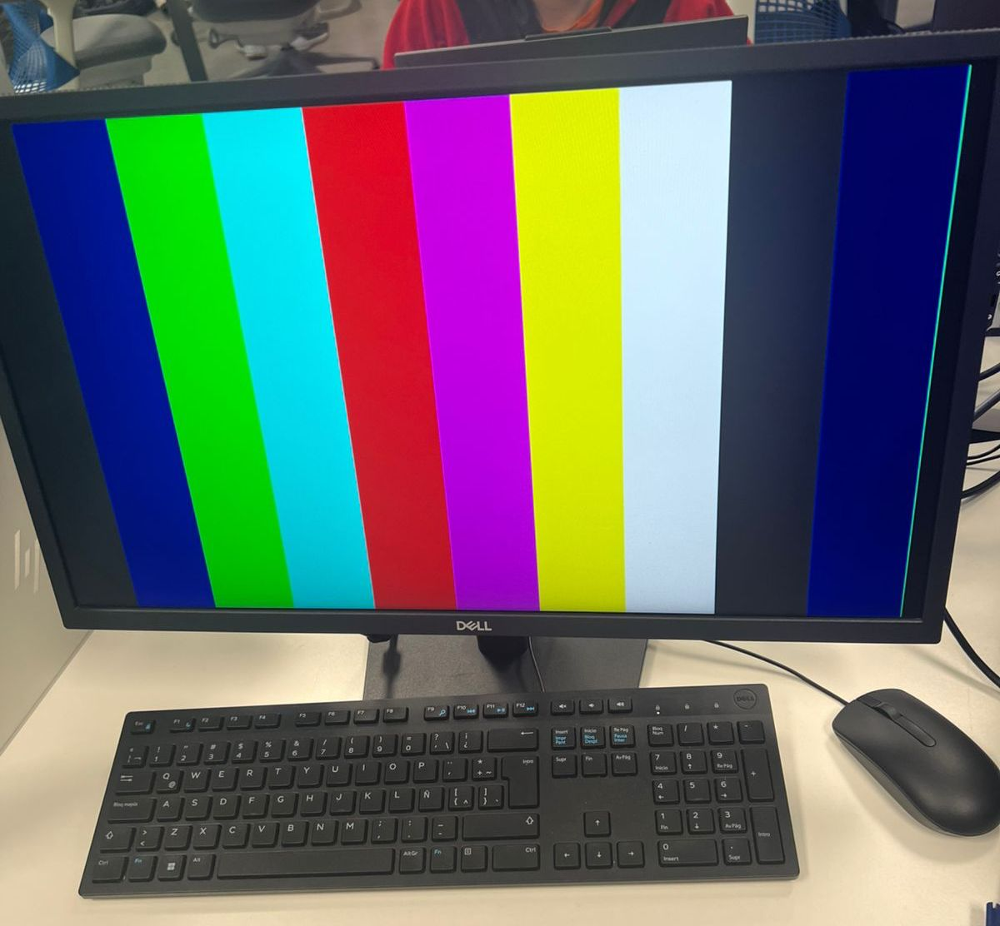
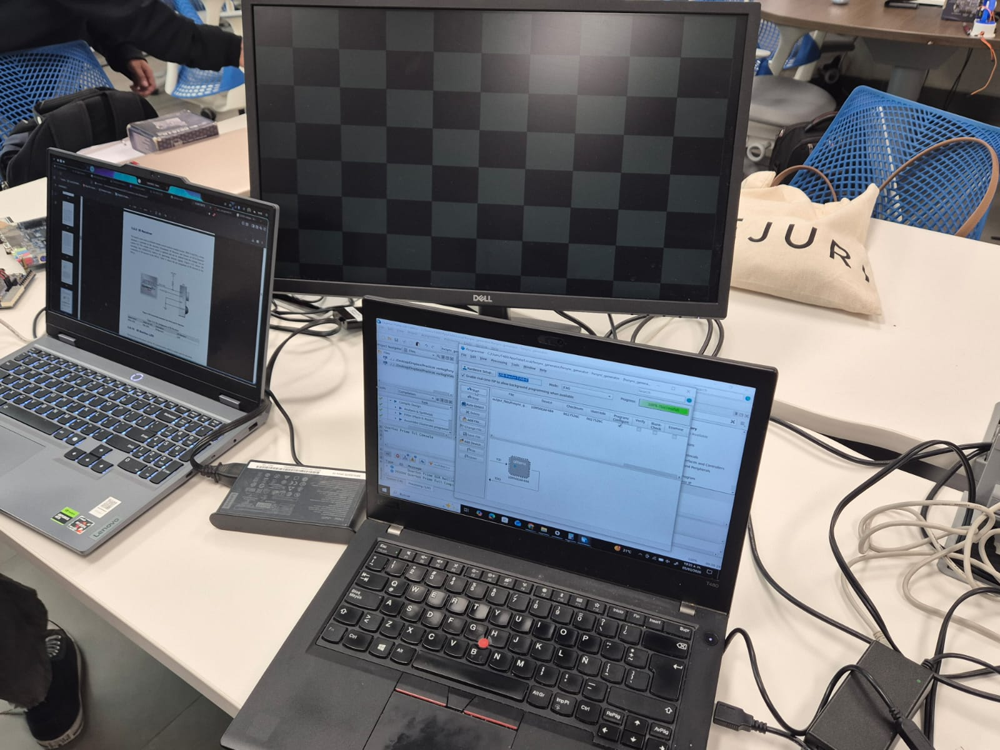

# Práctica 7: VGA

## hvsync_generator.v

Este módulo genera las **señales de sincronización horizontal y vertical para VGA**.  
También produce los contadores de posición del pixel (`CounterX` y `CounterY`) y la señal `inDisplayArea`, que indica cuándo el pixel se encuentra dentro del área visible de la pantalla.

La resolución utilizada corresponde al estándar **640×480 a 60 Hz**.

```verilog
module hvsync_generator (

    input clk,
    input pixel_tick,

    output vga_h_sync,
    output vga_v_sync,

    output reg inDisplayArea,
    output reg [9:0] CounterX = 0,
    output reg [9:0] CounterY = 0

);

    reg vga_HS = 0;
    reg vga_VS = 0;

    wire CounterXmaxed = (CounterX == 799);
    wire CounterYmaxed = (CounterY == 524);

    always @(posedge clk)
        begin
            if (pixel_tick)
                begin
                    if (CounterXmaxed)
                        CounterX <= 0;
                    else
                        CounterX <= CounterX + 1;
                end
        end

    always @(posedge clk)
        begin
            if (pixel_tick && CounterXmaxed)
                begin
                    if (CounterYmaxed)
                        CounterY <= 0;
                    else
                        CounterY <= CounterY + 1;
                end
        end

    always @(posedge clk)
        begin
            if (pixel_tick)
                vga_HS <= (CounterX >= (640 + 16) && CounterX < (640 + 16 + 96));
        end

    always @(posedge clk)
        begin
            if (pixel_tick)
                vga_VS <= (CounterY >= (480 + 10) && CounterY < (480 + 10 + 2));
        end

    always @(posedge clk)
        begin
            if (pixel_tick)
                inDisplayArea <= (CounterX < 640) && (CounterY < 480);
        end

    assign vga_h_sync = ~vga_HS;
    assign vga_v_sync = ~vga_VS;

endmodule
```

---

## VGADemo_Colores.v

Este módulo genera un **patrón de colores simple en la pantalla VGA**.  
El valor del color se obtiene a partir de los bits más significativos del contador horizontal (`CounterX`), lo que produce **bandas verticales de diferentes colores**.

También se genera un **pixel clock de 25 MHz** a partir del reloj de 50 MHz de la FPGA utilizando un divisor simple.

```verilog
module VGADemo_Colores (

    input MAX10_CLK1_50,
    output reg [2:0] pixel,
    output hsync_out,
    output vsync_out

);

    wire inDisplayArea;
    wire [9:0] CounterX;
    wire [9:0] CounterY;

    reg pixel_tick = 0;

    always @(posedge MAX10_CLK1_50)
        pixel_tick <= ~pixel_tick;

    hvsync_generator hvsync (
        .clk(MAX10_CLK1_50),
        .pixel_tick(pixel_tick),
        .vga_h_sync(hsync_out),
        .vga_v_sync(vsync_out),
        .CounterX(CounterX),
        .CounterY(CounterY),
        .inDisplayArea(inDisplayArea)
    ); 

    always @(posedge MAX10_CLK1_50)
        begin
            if (inDisplayArea)
                pixel <= CounterX[9:6];
            else
                pixel <= 3'b000;
        end
        
endmodule
```

---

## VGADemo_Ajedrez.v

Este módulo genera un **patrón de tablero de ajedrez** en la pantalla VGA.  
El patrón se crea utilizando la operación XOR entre bits de los contadores `CounterX` y `CounterY`, lo que produce cuadros alternados blancos y negros.

Cada cuadro del tablero se genera tomando un bit específico de cada contador para dividir la pantalla en regiones.

```verilog
module VGADemo_Ajedrez (

    input MAX10_CLK1_50,

    output [3:0] vga_red,
    output [3:0] vga_green,
    output [3:0] vga_blue,

    output hsync_out,
    output vsync_out

);

    wire inDisplayArea;
    wire [9:0] CounterX;
    wire [9:0] CounterY;

    // Generador de 25 MHz
    reg pixel_tick = 0;

    always @(posedge MAX10_CLK1_50)
        begin
            pixel_tick <= ~pixel_tick;
        end

    hvsync_generator hvsync (

        .clk(MAX10_CLK1_50),
        .pixel_tick(pixel_tick),
        .vga_h_sync(hsync_out),
        .vga_v_sync(vsync_out),
        .CounterX(CounterX),
        .CounterY(CounterY),
        .inDisplayArea(inDisplayArea)

    );

    // Lógica del patrón tipo ajedrez
    wire is_white;

    assign is_white = CounterX[6] ^ CounterY[6];

    assign vga_red   = (inDisplayArea && is_white) ? 4'b1111 : 4'b0000;
    assign vga_green = (inDisplayArea && is_white) ? 4'b1111 : 4'b0000;
    assign vga_blue  = (inDisplayArea && is_white) ? 4'b1111 : 4'b0000;

endmodule
```

---

## Resultado del patrón de colores



---

## Resultado del patrón tipo ajedrez


