# Práctica 1: Detector de Números Primos

## Num_Primos.v

El módulo recibe el valor de los 4 switches de la FPGA y determina si el número binario corresponde a un número primo.  
Si el número es primo, el LED se enciende; en caso contrario, el LED permanece apagado.

```verilog
module Num_Primos (

	input [3:0] SW,
	output reg LED
	
);
	
	always @(*)
		begin
			case (SW)	
		    	4'b0010:LED = 1'b1;	// Estos son los números primos definidos del 2 al 13 y tienen como salida el 1 y se prende el LED
				4'b0011:LED = 1'b1;
				4'b0101:LED = 1'b1;
				4'b0111:LED = 1'b1;
				4'b1011:LED = 1'b1;
				4'b1101:LED = 1'b1;
				default:LED = 1'b0;	// El default es para que los números sin definir tengan como salida el 0 y se apague el LED
			endcase
		end

endmodule
```

---

## Código del testbench: Num_Primos_tb.v

El testbench genera valores de entrada del 0 al 15 para verificar el funcionamiento del sistema durante la simulación.

```verilog
module Num_Primos_tb();

    reg [3:0] SW;
    wire LED;

    Num_Primos dut(.SW(SW),.LED(LED));

    initial 
        begin
            $display("Simulacion iniciada");

            SW = 4'b0000; #10;
            SW = 4'b0001; #10;
            SW = 4'b0010; #10;
            SW = 4'b0011; #10;
            SW = 4'b0100; #10;
            SW = 4'b0101; #10;
            SW = 4'b0110; #10;
            SW = 4'b0111; #10;
            SW = 4'b1000; #10;
            SW = 4'b1001; #10;
            SW = 4'b1010; #10;
            SW = 4'b1011; #10;
            SW = 4'b1100; #10;
            SW = 4'b1101; #10;
            SW = 4'b1110; #10;
            SW = 4'b1111; #10;

            $display("Simulacion finalizada");
            $finish;
        end

    initial 
        begin
            $monitor("SW = %b, LED = %b", SW, LED);
        end

    initial 
        begin
            $dumpfile("Num_Primos_tb.vcd");
            $dumpvars(0, Num_Primos_tb);
        end

endmodule
```

---

## Testbench


---

## Simulación del testbench

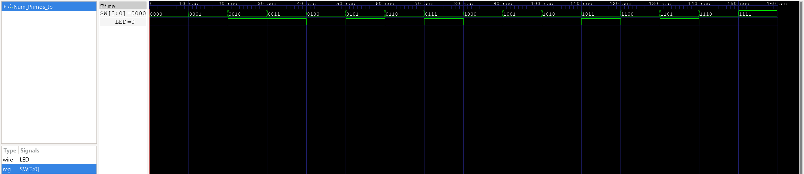

---

## RTL

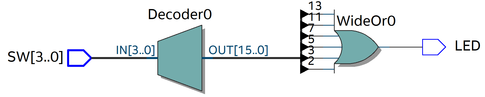

---

## Pruebas con la tarjeta FPGA DE10-Lite

### Pruebas con números primos (LED encendido)

#### Entrada = 2 (0010)
.jpeg)

#### Entrada = 3 (0011)
.jpeg)

En ambos casos el LED se enciende porque los valores de entrada son números primos.

---

### Pruebas con números no primos (LED apagado)

#### Entrada = 6 (0110)
.jpeg)

#### Entrada = 15 (1111)
.jpeg)

En estos casos el LED no se enciende porque los valores de entrada no son números primos.

---

# Práctica 2: BCD

## BCD_4Displays_W.v

El módulo wrapper conecta las entradas de los switches de la FPGA con el módulo principal `BCD_4Displays` y envía las salidas a los displays de 7 segmentos.

```verilog
module BCD_4Displays_W (

    input  [9:0] SW,
    output [6:0] HEX0, HEX1, HEX2, HEX3
    
);

    BCD_4Displays WRAP (
        .bcd_in(SW), 
        .D_un(HEX0), 
        .D_de(HEX1), 
        .D_ce(HEX2), 
        .D_mi(HEX3)
    );

endmodule
```

---

## BCD_Module.v

Este módulo convierte un dígito BCD (0–9) a su representación en display de 7 segmentos.

```verilog
module BCD_module (

	input  [3:0] bcd_in,
	output reg [6:0] bcd_out

);

	always @(*) 
		begin
			case (bcd_in)
				4'b0000:bcd_out = ~7'b1111110;
				4'b0001:bcd_out = ~7'b0110000;
				4'b0010:bcd_out = ~7'b1101101;
				4'b0011:bcd_out = ~7'b1111001;
				4'b0100:bcd_out = ~7'b0110011;
				4'b0101:bcd_out = ~7'b1011011;
				4'b0110:bcd_out = ~7'b1011111;
				4'b0111:bcd_out = ~7'b1110000;
				4'b1000:bcd_out = ~7'b1111111;
				4'b1001:bcd_out = ~7'b1111011;
				default:bcd_out = ~7'b0000000;
			endcase
		end
	
endmodule
```

---

## BCD_Module_tb.v

El testbench genera valores aleatorios para verificar el funcionamiento del módulo durante la simulación.

```verilog
module BCD_module_tb();

    reg [3:0] bcd_in;
    wire [6:0] bcd_out;

    BCD_module dut(
        .bcd_in(bcd_in), 
        .bcd_out(bcd_out)
    );

    initial 
        begin
            repeat (32) // 32 es el número de iteraciones de las repeticiones
            begin
                bcd_in = $random % 16; #10; // $random es para generar un número aleatorio y el % 16 es para dividir el número entre 16 y nos daría un número menor que 16
            end
                $finish;
        end

    initial 
        begin
            $monitor("bcd_in = %b, bcd_out = %b", bcd_in, bcd_out);
        end

    initial 
        begin
            $dumpfile("BCD_module_tb.vcd");
            $dumpvars(0, BCD_module_tb);
        end

endmodule
```

---

## Testbench

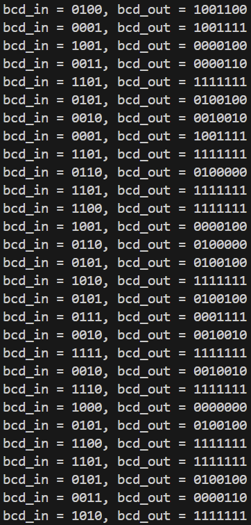

---

## Simulación del testbench


---

## RTL

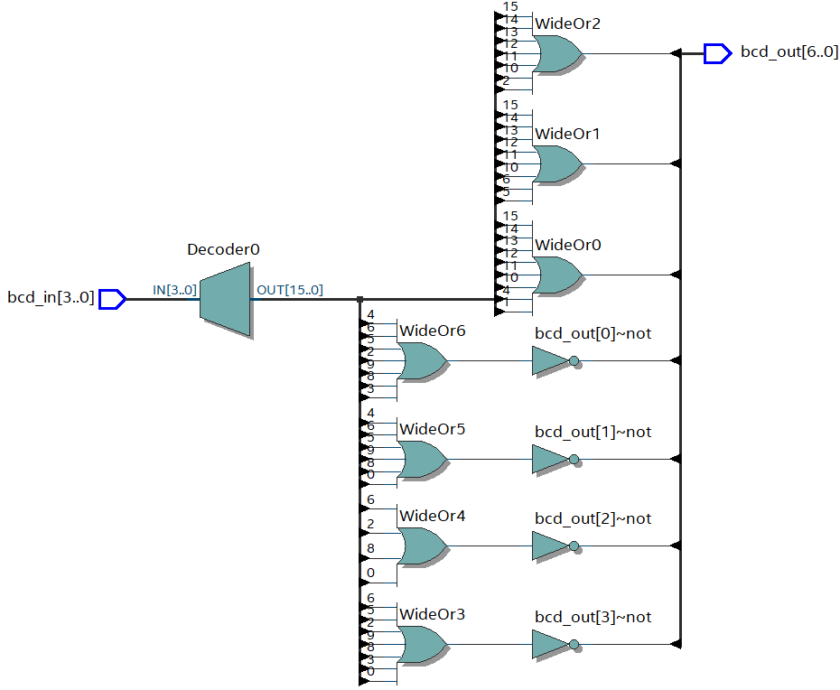

---

## BCD_4Displays.v

El módulo principal recibe un número binario de 10 bits y lo separa en unidades, decenas, centenas y millares.  
Cada dígito es convertido a su representación para display de 7 segmentos mediante el módulo `BCD_module`.

```verilog
module BCD_4Displays #(parameter N_in = 10, N_out = 7) (

    input [N_in - 1:0] bcd_in,
    output [N_out - 1:0] D_un, D_de, D_ce, D_mi,
    output [3:0] unidades, decenas, centenas, millares
    
);

    assign unidades = bcd_in % 10;
    assign decenas = (bcd_in / 10) % 10;
    assign centenas = (bcd_in / 100) % 10;
    assign millares = (bcd_in / 1000) % 10;

    BCD_module Unidades (
        .bcd_in(unidades), 
        .bcd_out(D_un)
    );

    BCD_module Decenas (
        .bcd_in(decenas), 
        .bcd_out(D_de)
    );

    BCD_module Centenas (
        .bcd_in(centenas), 
        .bcd_out(D_ce)
    );

    BCD_module Millares (
        .bcd_in(millares), 
        .bcd_out(D_mi)
    );

endmodule
```

---

## BCD_4Displays_tb.v

El testbench genera valores entre 0 y 1023 para verificar la correcta separación de los dígitos y su conversión.

```verilog
module BCD_4Displays_tb();

    reg  [9:0] bcd_in;
    wire [6:0] D_un, D_de, D_ce, D_mi;
    wire [3:0] unidades, decenas, centenas, millares;

    BCD_4Displays dut(
        .bcd_in(bcd_in), 
        .D_un(D_un), 
        .D_de(D_de), 
        .D_ce(D_ce), 
        .D_mi(D_mi), 
        .unidades(unidades), 
        .decenas(decenas), 
        .centenas(centenas), 
        .millares(millares)
    );

    initial 
        begin
            repeat (10)
            begin
                bcd_in = $random % 1024; #10;
            end
                $finish;
        end

    initial 
        begin
            $monitor("bcd_in = %d, Unidades = %d, Decenas = %d, Centenas = %d, Millares = %d", bcd_in, unidades, decenas, centenas, millares);
        end

    initial 
        begin
            $dumpfile("BCD_4Displays_tb.vcd");
            $dumpvars(0, BCD_4Displays_tb);
        end
        
endmodule
```

---

## Testbench


---

## Simulación del testbench


---

## RTL


---

## Pruebas con la tarjeta FPGA DE10-Lite

[Ver video de la prueba](Practica_2_BCD/BCD_4Displays.mp4)

---

# Práctica 3: Contador Ascendente y Descendente con Load y Reset

## BCD_module.v

Este módulo convierte un dígito BCD a su representación en display de 7 segmentos.

```verilog
module BCD_module (

	input  [3:0] bcd_in,
	output reg [6:0] bcd_out

);

	always @(*) 
		begin
			case (bcd_in)
				4'b0000:bcd_out = ~7'b1111110;
				4'b0001:bcd_out = ~7'b0110000;
				4'b0010:bcd_out = ~7'b1101101;
				4'b0011:bcd_out = ~7'b1111001;
				4'b0100:bcd_out = ~7'b0110011;
				4'b0101:bcd_out = ~7'b1011011;
				4'b0110:bcd_out = ~7'b1011111;
				4'b0111:bcd_out = ~7'b1110000;
				4'b1000:bcd_out = ~7'b1111111;
				4'b1001:bcd_out = ~7'b1111011;
				default:bcd_out = ~7'b0000000;
			endcase
		end
	
endmodule
```

---

## BCD_4Displays.v

El módulo recibe el valor del contador y lo separa en unidades, decenas, centenas y millares para mostrarlos en los displays.

```verilog
module BCD_4Displays #(parameter N_in = 14, N_out = 7) (

    input [N_in - 1:0] bcd_in,
    output [N_out - 1:0] D_un, D_de, D_ce, D_mi,
    output [3:0] unidades, decenas, centenas, millares
    
);

    assign unidades = bcd_in % 10;
    assign decenas = (bcd_in / 10) % 10;
    assign centenas = (bcd_in / 100) % 10;
    assign millares = (bcd_in / 1000) % 10;

    BCD_module Unidades (
        .bcd_in(unidades), 
        .bcd_out(D_un)
    );

    BCD_module Decenas (
        .bcd_in(decenas), 
        .bcd_out(D_de)
    );

    BCD_module Centenas (
        .bcd_in(centenas), 
        .bcd_out(D_ce)
    );

    BCD_module Millares (
        .bcd_in(millares), 
        .bcd_out(D_mi)
    );

endmodule
```

---

## counter_wr.v

El módulo wrapper conecta los botones, switches y reloj de la FPGA con el sistema del contador.  
Incluye divisor de frecuencia, contador y módulo de visualización en displays de 7 segmentos.

```verilog
module counter_wr (

    input MAX10_CLK1_50,
    input [1:0] KEY,
    input [13:0] SW,

    output [0:6] HEX0,
    output [0:6] HEX1,
    output [0:6] HEX2,
    output [0:6] HEX3

);

    wire rst;
    wire load;
    wire up_down;
    wire slow_clk;
    wire [13:0] data_in;
    wire [13:0] count_value;

    assign rst = ~KEY[0];
    assign load = ~KEY[1];
    assign up_down = SW[13];
    assign data_in = SW;

    clock_divider #(.FREQ(1)) clk_div (
        .clk(MAX10_CLK1_50), 
        .rst(rst), 
        .clk_div(slow_clk)
    );

    counter #(.CMAX(100)) counter (
        .clk(slow_clk), 
        .rst(rst), 
        .load(load), 
        .up_down(up_down), 
        .data_in(data_in), 
        .count(count_value)
    );

    BCD_4Displays display (
        .bcd_in(count_value), 
        .D_un(HEX0), 
        .D_de(HEX1), 
        .D_ce(HEX2), 
        .D_mi(HEX3)
    );

endmodule
```

---

## clock_divider.v

El módulo divisor de frecuencia reduce la señal de 50 MHz de la FPGA a una frecuencia más baja para poder visualizar el conteo en los displays.

```verilog
module clock_divider #(parameter FREQ = 1) (

    input clk,
    input rst,
    output reg clk_div

);

    parameter CLK_FREQ = 50000000;
    parameter COUNT_MAX = (CLK_FREQ / (2 * FREQ));

    reg [31:0] count;

    always @(posedge clk)
        begin
            if (rst == 1'b1)
                begin
                    count <= 32'b0;
                end
            else if (count == COUNT_MAX - 1)
                begin
                    count <= 32'b0;
                end
            else
                begin
                    count <= count + 1;
                end
        end

    always @(posedge clk)
        begin
            if (rst == 1'b1)
                begin
                    clk_div <= 1'b0;
                end
            else if (count == COUNT_MAX - 1)
                begin
                    clk_div <= ~clk_div;
                end
        end

endmodule
```

---

## counter.v

El módulo contador permite contar de manera ascendente o descendente dependiendo del switch `up_down`.  
Incluye botón de `reset` para reiniciar a 0 y botón `load` para cargar un valor inicial.

```verilog
module counter #(parameter CMAX = 100) (

    input clk,
    input rst,
    input load,
    input up_down,
    input [13:0] data_in,
    output reg [13:0] count

);

    always @(posedge clk)
        begin
            if (rst)
                begin
                    count <= 0;
                end
            else if (load)
                begin
                    count <= data_in;
                end
            else if (up_down)
                begin
                    if (count == CMAX)
                        count <= 0;
                    else
                        count <= count + 1;
                end
            else
                begin
                    if (count == 0)
                        count <= CMAX;
                    else
                        count <= count - 1;
                end
        end

endmodule
```

---

## counter_tb.v

El testbench verifica el funcionamiento del contador probando reset, conteo ascendente, descendente y carga de datos.

```verilog
module counter_tb();

    reg clk;
    reg rst;
    reg load;
    reg up_down;
    reg [13:0] data_in;
    wire [13:0] count;

    counter #(.CMAX(100)) dut(
        .clk(clk),
        .rst(rst),
        .load(load),
        .up_down(up_down),
        .data_in(data_in),
        .count(count)
    );

    initial 
        begin
            clk = 0;
            forever #10 clk = ~clk;
        end

    initial 
        begin
            $display("Reset");
            rst = 1; load = 0; up_down = 1; data_in = 0; #50;
            rst = 0;

            $display("Subiendo");
            #200;

            $display("Bajando");
            up_down = 0;
            #300;

            $display("Load con el valor 8");
            load = 1; data_in = 14'd8; #50;
            load = 0;

            $display("Subiendo");
            up_down = 1;
            #100;

            $display("Reset");
            rst = 1; #50;

            $stop;
            $finish;
        end

    initial 
        begin
            $monitor("rst = %b, load = %b | up_down = %b | count = %d", rst, load, up_down, count);
        end

    initial 
        begin
            $dumpfile("counter_tb.vcd");
            $dumpvars(0, counter_tb);
        end

endmodule
```

---

## Testbench

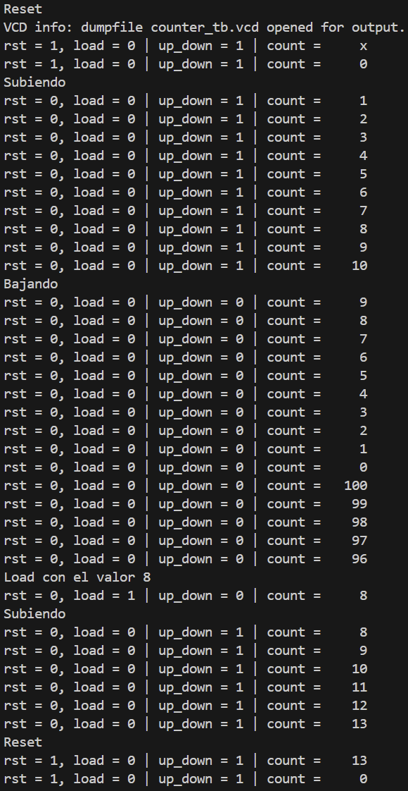

---

## Simulación del testbench

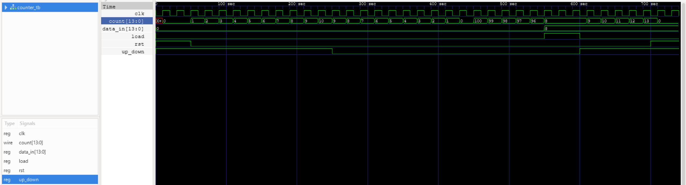

---

## RTL

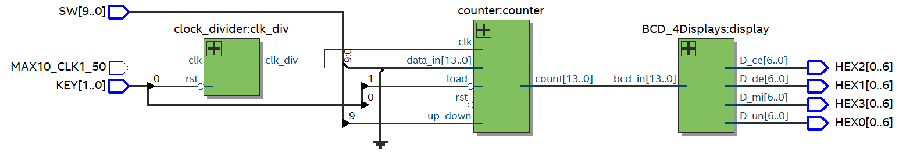

---

## Prueba en la tarjeta FPGA

[Ver video de la prueba](Practica_3_Contador_Sincrono/Counter.mp4)

---

# Práctica 4: Sistema de Password con Máquina de Estados

## BCD_module.v

Este módulo convierte un dígito BCD (0–9) a su representación en display de 7 segmentos.

```verilog
module BCD_module (

	input  [3:0] bcd_in,
	output reg [6:0] bcd_out

);

	always @(*) 
		begin
			case (bcd_in)
				4'b0000:bcd_out = ~7'b1111110;
				4'b0001:bcd_out = ~7'b0110000;
				4'b0010:bcd_out = ~7'b1101101;
				4'b0011:bcd_out = ~7'b1111001;
				4'b0100:bcd_out = ~7'b0110011;
				4'b0101:bcd_out = ~7'b1011011;
				4'b0110:bcd_out = ~7'b1011111;
				4'b0111:bcd_out = ~7'b1110000;
				4'b1000:bcd_out = ~7'b1111111;
				4'b1001:bcd_out = ~7'b1111011;
				default:bcd_out = ~7'b0000000;
			endcase
		end
	
endmodule
```

---

## password_wr.v

El módulo wrapper conecta los botones, switches y reloj de la FPGA con el sistema del password.

```verilog
module password_wr (

    input MAX10_CLK1_50,
    input [9:0] SW,
    input [1:0] KEY,

    output [0:6] HEX0,
    output [0:6] HEX1,
    output [0:6] HEX2,
    output [0:6] HEX3

);

    password dut (

        .clk(MAX10_CLK1_50),
        .rst(~KEY[0]),
        .load(~KEY[1]),
        .SW(SW[3:0]),

        .HEX0(HEX0),
        .HEX1(HEX1),
        .HEX2(HEX2),
        .HEX3(HEX3)

    );

endmodule
```

---

## password.v

Este módulo implementa el sistema de contraseña utilizando una **máquina de estados finitos (FSM)**.

```verilog
module password (

    input clk,
    input rst,
    input load,
    input [3:0] SW,

    output reg [6:0] HEX0,
    output reg [6:0] HEX1,
    output reg [6:0] HEX2,
    output reg [6:0] HEX3

);

    parameter [15:0] password = 16'h1234;

    parameter IDLE = 3'd0,
              S1   = 3'd1,
              S2   = 3'd2,
              S3   = 3'd3,
              GOOD = 3'd4,
              BAD  = 3'd5;

    reg [2:0] state, next_state;

    reg load_sync0, load_sync1;
    wire load_pulse;

    wire [6:0] bcd_out;

    BCD_module bcd_inst (
        .bcd_in(SW),
        .bcd_out(bcd_out)
    );

    always @(posedge clk)
		begin
			load_sync0 <= load;
			load_sync1 <= load_sync0;
		end

    assign load_pulse = load_sync0 & ~load_sync1;

    always @(posedge clk or posedge rst)
		begin
			if (rst)
				state <= IDLE;
			else
				state <= next_state;
		end

    always @(*)
		begin
			next_state = state;

			case (state)

				IDLE:
					if (load_pulse)
						if (SW == password[15:12])
							next_state = S1;
						else
							next_state = BAD;

				S1:
					if (load_pulse)
						if (SW == password[11:8])
							next_state = S2;
						else
							next_state = BAD;

				S2:
					if (load_pulse)
						if (SW == password[7:4])
							next_state = S3;
						else
							next_state = BAD;

				S3:
					if (load_pulse)
						if (SW == password[3:0])
							next_state = GOOD;
						else
							next_state = BAD;

				GOOD:
					next_state = GOOD;

				BAD:
					next_state = BAD;

			endcase
		end

    always @(*)
		begin
			HEX0 = 7'b1111111;
			HEX1 = 7'b1111111;
			HEX2 = 7'b1111111;
			HEX3 = 7'b1111111;

			case (state)

				IDLE, S1, S2, S3:
					HEX0 = bcd_out;

				GOOD:
				begin
					HEX3 = ~7'b0111101; // G
					HEX2 = ~7'b1111110; // O
					HEX1 = ~7'b1111110; // O
					HEX0 = ~7'b0111101; // d
				end

				BAD:
				begin
					HEX3 = ~7'b0011111; // b
					HEX2 = ~7'b1110111; // A
					HEX1 = ~7'b0111101; // D
					HEX0 = 7'b1111111;  // Display apagado
				end

			endcase
		end

endmodule
```

---

## password_tb.v

El testbench verifica el funcionamiento del sistema probando una contraseña correcta e incorrecta.

```verilog
module password_tb();

    reg clk;
    reg rst;
    reg load;
    reg [3:0] SW;

    wire [6:0] HEX0;
    wire [6:0] HEX1;
    wire [6:0] HEX2;
    wire [6:0] HEX3;

    password dut(
        .clk(clk),
        .rst(rst),
        .load(load),
        .SW(SW),
        .HEX0(HEX0),
        .HEX1(HEX1),
        .HEX2(HEX2),
        .HEX3(HEX3)
    );

    initial 
        begin
            clk = 0;
            forever #10 clk = ~clk;
        end

    initial 
        begin
            rst = 1; 
            load = 0; 
            SW = 0; 
            #20;

            rst = 0;

            // Contraseña correcta: 1-2-3-4
            SW = 4'h1; #20;
            load = 1; #20;
            load = 0; #20;

            SW = 4'h2; #20;
            load = 1; #20;
            load = 0; #20;

            SW = 4'h3; #20;
            load = 1; #20;
            load = 0; #20;

            SW = 4'h4; #20;
            load = 1; #20;
            load = 0; #40;

            // Reset
            rst = 1; #20;
            rst = 0; #20;

            // Contraseña incorrecta
            SW = 4'h5; #20;
            load = 1; #20;
            load = 0; #40;

            $stop;
            $finish;
        end

    initial 
        begin
            $monitor("rst = %b, load = %b, SW = %h, HEX3 = %b, HEX2 = %b, HEX1 = %b, HEX0 = %b",
                     rst, load, SW, HEX3, HEX2, HEX1, HEX0);
        end

    initial 
        begin
            $dumpfile("password_tb.vcd");
            $dumpvars(0, password_tb);
        end

endmodule
```

---

## Testbench


---

## Simulación del testbench

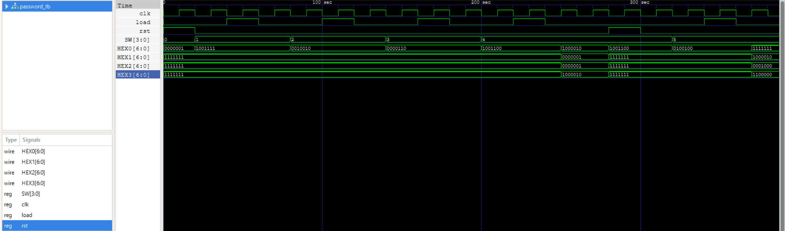

---

## RTL


---

## Máquina de Estados (FSM)

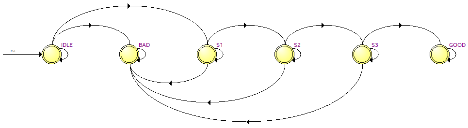

---

## Prueba en la tarjeta FPGA

[Ver video de la prueba](Practica_4_Password/Password.mp4)

---

# Práctica 5: PWM

## PWM.v

Este módulo implementa un generador de **PWM (Pulse Width Modulation)** para controlar el ángulo de un servo utilizando los switches de la FPGA.  
El valor ingresado en los switches representa el **grado del servo (0° a 180°)**. Si el valor supera 180, se limita automáticamente.  
El sistema también muestra el valor del ángulo en **tres displays de 7 segmentos**.

```verilog
module PWM (

    input MAX10_CLK1_50,
    input [9:0] SW,

    output [15:0] ARDUINO_IO,
    output [0:6] HEX0,
    output [0:6] HEX1,
    output [0:6] HEX2

);

    wire rst = SW[0];
    wire [7:0] grado_raw = SW[8:1];

    reg [7:0] grado;

    wire [3:0] uni;
    wire [3:0] dec;
    wire [3:0] cen;

    always @(*)
        begin
            if (grado_raw > 8'd180)
                grado = 8'd180;
            else
                grado = grado_raw;
        end

    wire clk_div;
    reg [18:0] count = 0;
    wire [18:0] duty;
    wire arduino;

    parameter maxCount = 500000;

    clock_divider #(.FREQ(25000000)) clkdiv (
        .clk(MAX10_CLK1_50),
        .rst(rst),
        .clk_div(clk_div)
    );

    assign duty = 25000 + (grado * 25000) / 180;

    always @(posedge clk_div or posedge rst)
        begin
            if (rst)
                count <= 0;
            else if (count >= maxCount)
                count <= 0;
            else
                count <= count + 1;
        end

    assign arduino = (count < duty);
    assign ARDUINO_IO[0] = arduino;

    assign uni = grado % 10;
    assign dec = (grado / 10) % 10;
    assign cen = (grado / 100) % 10;

    BCD_module d0 (
        .bcd_in(uni), 
        .bcd_out(HEX0)
    );

    BCD_module d1 (
        .bcd_in(dec), 
        .bcd_out(HEX1)
    );

    BCD_module d2 (
        .bcd_in(cen), 
        .bcd_out(HEX2)
    );

endmodule
```

---

## PWM_tb.v

El **testbench** se utiliza para verificar el funcionamiento del generador PWM.  
Se simula el reloj de 50 MHz, se aplica un reset inicial y posteriormente se prueban distintos valores de ángulo generados aleatoriamente.

```verilog
module PWM_tb ();

    //Señales de entrada
    reg MAX10_CLK1_50;
    reg [9:0] SW;

    //Señales de salida
    wire [15:0] ARDUINO_IO;
    wire [0:6] HEX0;
    wire [0:6] HEX1;
    wire [0:6] HEX2;

    //Instancia del módulo
    PWM PWM (
        .MAX10_CLK1_50(MAX10_CLK1_50),
        .SW(SW),
        .ARDUINO_IO(ARDUINO_IO),
        .HEX0(HEX0),
        .HEX1(HEX1),
        .HEX2(HEX2)
    );

    initial
        begin
            MAX10_CLK1_50 = 0;
            SW = 10'b0;
        end

    always
        #10 MAX10_CLK1_50 = ~MAX10_CLK1_50;

    initial
        begin
            $display("Simulacion iniciada");

            #30;

            SW[0] = 1;
            #20;
            SW[0] = 0;

            #1000;

            repeat(6)
                begin
                    SW[8:1] = $random % 200;
                    #2000000;

                    $display("Grados solicitados = %d | Grados limitados = %d | PWM = %b", SW[8:1], PWM.grado, ARDUINO_IO[0]);
                end

            $stop;
            $finish;
        end

    initial
        begin
            $dumpfile("PWM_tb.vcd");
            $dumpvars(0, PWM_tb);
        end

endmodule
```

---

## clock_divider.v

Este módulo divide la frecuencia del reloj de la FPGA para generar un reloj más lento que pueda ser utilizado por otros módulos del sistema.

```verilog
module clock_divider #(parameter FREQ = 1) (

    input clk,
    input rst,
    output reg clk_div

);

    parameter CLK_FREQ = 50000000;
    parameter COUNT_MAX = (CLK_FREQ / (2 * FREQ));

    reg [31:0] count;

    always @(posedge clk)
        begin
            if (rst == 1'b1)
                begin
                    count <= 32'b0;
                end
            else if (count == COUNT_MAX - 1)
                begin
                    count <= 32'b0;
                end
            else
                begin
                    count <= count + 1;
                end
        end

    always @(posedge clk)
        begin
            if (rst == 1'b1)
                begin
                    clk_div <= 1'b0;
                end
            else if (count == COUNT_MAX - 1)
                begin
                    clk_div <= ~clk_div;
                end
        end

endmodule
```

---

## BCD_module.v

Este módulo convierte un dígito BCD a su representación en **display de 7 segmentos**.

```verilog
module BCD_module (

	input  [3:0] bcd_in,
	output reg [6:0] bcd_out

);

	always @(*) 
		begin
			case (bcd_in)
				4'b0000:bcd_out = ~7'b1111110;
				4'b0001:bcd_out = ~7'b0110000;
				4'b0010:bcd_out = ~7'b1101101;
				4'b0011:bcd_out = ~7'b1111001;
				4'b0100:bcd_out = ~7'b0110011;
				4'b0101:bcd_out = ~7'b1011011;
				4'b0110:bcd_out = ~7'b1011111;
				4'b0111:bcd_out = ~7'b1110000;
				4'b1000:bcd_out = ~7'b1111111;
				4'b1001:bcd_out = ~7'b1111011;
				default:bcd_out = ~7'b0000000;
			endcase
		end
	
endmodule
```

---

## Testbench


---

## Simulación del testbench


---

# Práctica 6: UART

## UART_TX.v

Este módulo implementa el **transmisor UART (Universal Asynchronous Receiver Transmitter)**.  
Se encarga de enviar datos en serie a través de la línea `tx_out`.

El funcionamiento se basa en una **máquina de estados** con cuatro etapas:

- **IDLE:** la línea permanece en estado inactivo esperando iniciar transmisión.
- **START_BIT:** se envía el bit de inicio (`0`).
- **DATA_BITS:** se transmiten los bits del dato uno por uno.
- **STOP_BIT:** se envía el bit de parada (`1`) y finaliza la transmisión.

```verilog
module UART_TX #(parameter BAUD_RATE = 9600, parameter CLOCK_FREQ = 50000000, parameter BITS = 8)(

    input wire clk,
    input wire rst,
    input wire [BITS - 1:0] data_in,
    input wire start,

    output reg tx_out,
    output reg busy

);

    localparam IDLE = 2'b00, START_BIT = 2'b01, DATA_BITS = 2'b10, STOP_BIT = 2'b11;

    reg [1:0] state;
    reg [3:0] bit_index;
    reg [15:0] baud_counter;
    reg [BITS-1:0] data_buffer;

    always @(posedge clk or posedge rst)
        begin
            if (rst)
                begin
                    state <= IDLE;
                    tx_out <= 1'b1;
                    busy <= 0;
                    bit_index <= 0;
                    baud_counter <= 0;
                end
            else
                begin
                    case (state)

                        IDLE:
                            begin
                                tx_out <= 1'b1;
                                busy <= 0;

                                if (start)
                                    begin
                                        data_buffer <= data_in;
                                        state <= START_BIT;
                                        busy <= 1;
                                    end
                            end

                        START_BIT:
                            begin
                                tx_out <= 1'b0;

                                if (baud_counter < (CLOCK_FREQ / BAUD_RATE) - 1)
                                    baud_counter <= baud_counter + 1;
                                else
                                    begin
                                        baud_counter <= 0;
                                        state <= DATA_BITS;
                                        bit_index <= 0;
                                    end
                            end

                        DATA_BITS:
                            begin
                                tx_out <= data_buffer[bit_index];

                                if (baud_counter < CLOCK_FREQ / BAUD_RATE - 1)
                                    baud_counter <= baud_counter + 1;
                                else
                                    begin
                                        baud_counter <= 0;

                                        if (bit_index < BITS - 1)
                                            bit_index <= bit_index + 1;
                                        else
                                            state <= STOP_BIT;
                                    end
                            end

                        STOP_BIT:
                            begin
                                tx_out <= 1'b1;

                                if (baud_counter < CLOCK_FREQ / BAUD_RATE - 1)
                                    baud_counter <= baud_counter + 1;
                                else
                                    begin
                                        baud_counter <= 0;
                                        state <= IDLE;
                                    end
                            end

                    endcase
                end
        end

endmodule
```

---

## UART_RX.v

Este módulo implementa el **receptor UART**, encargado de recibir los datos seriales desde la línea `rx_in` y reconstruirlos en formato paralelo.

El proceso de recepción sigue los siguientes estados:

- **IDLE:** espera detectar el bit de inicio.
- **START_BIT:** sincroniza la lectura en la mitad del bit.
- **DATA_BITS:** captura los bits del dato uno por uno.
- **STOP_BIT:** valida el bit de parada y habilita la señal `data_ready`.

```verilog
module UART_RX #(parameter BAUD_RATE = 9600, parameter CLOCK_FREQ = 50000000, parameter BITS = 8) (

    input clk,
    input rst,
    input rx_in,

    output reg [BITS - 1:0] data_out,
    output reg data_ready

);

    localparam IDLE = 2'b00;
    localparam START_BIT = 2'b01;
    localparam DATA_BITS = 2'b10;
    localparam STOP_BIT = 2'b11;

    reg [1:0] state;
    reg [3:0] bit_index;
    reg [15:0] baud_counter;
    reg [BITS-1:0] data_buffer;

    always @(posedge clk or posedge rst)
        begin
            if (rst)
                begin
                    state <= IDLE;
                    data_out <= 0;
                    data_ready <= 0;
                    bit_index <= 0;
                    baud_counter <= 0;
                end
            else
                begin
                    case (state)

                        IDLE:
                            begin
                                data_ready <= 0;

                                if (!rx_in)
                                    begin
                                        state <= START_BIT;
                                        baud_counter <= 0;
                                    end
                            end

                        START_BIT:
                            begin
                                if (baud_counter < (CLOCK_FREQ / BAUD_RATE) / 2)
                                    baud_counter <= baud_counter + 1;
                                else
                                    begin
                                        baud_counter <= 0;
                                        state <= DATA_BITS;
                                        bit_index <= 0;
                                    end
                            end

                        DATA_BITS:
                            begin
                                if (baud_counter < CLOCK_FREQ / BAUD_RATE - 1)
                                    baud_counter <= baud_counter + 1;
                                else
                                    begin
                                        baud_counter <= 0;
                                        data_buffer[bit_index] <= rx_in;

                                        if (bit_index < BITS - 1)
                                            bit_index <= bit_index + 1;
                                        else
                                            state <= STOP_BIT;
                                    end
                            end

                        STOP_BIT:
                            begin
                                if (baud_counter < CLOCK_FREQ / BAUD_RATE - 1)
                                    baud_counter <= baud_counter + 1;
                                else
                                    begin
                                        baud_counter <= 0;
                                        data_out <= data_buffer;
                                        data_ready <= 1;
                                        state <= IDLE;
                                    end
                            end

                    endcase
                end
        end

endmodule
```

---

## transmiter.v

Este módulo funciona como el **top module del transmisor UART en la FPGA**.  
Los switches (`SW`) permiten ingresar un valor de **8 bits**, el cual se envía mediante UART al presionar el botón `KEY[0]`.  

El valor también se muestra en **tres displays de 7 segmentos**.

```verilog
module transmiter (

    input CLOCK_50,
    input [9:0] SW,
    input [3:0] KEY,

    output [0:6] HEX0,
    output [0:6] HEX1,
    output [0:6] HEX2,
    output GPIO_0

);

    wire rst = SW[9];
    wire start_signal = ~KEY[0];
    wire uart_busy;
    wire tx_line;

    wire [7:0] cuenta = SW[7:0];

    wire [3:0] un = cuenta % 10;
    wire [3:0] de = (cuenta / 10) % 10;
    wire [3:0] ce = (cuenta / 100) % 10;

    UART_TX #(.BAUD_RATE(9600), .CLOCK_FREQ(50000000), .BITS(8)) uart_tx (
        .clk(CLOCK_50),
        .rst(rst),
        .data_in(cuenta),
        .start(start_signal),
        .tx_out(tx_line),
        .busy(uart_busy)
    );

    BCD_module unidades (
        .bcd_in(un),
        .bcd_out(HEX0)
    );

    BCD_module decenas (
        .bcd_in(de),
        .bcd_out(HEX1)
    );

    BCD_module centenas (
        .bcd_in(ce),
        .bcd_out(HEX2)
    );

    assign GPIO_0 = tx_line;

endmodule
```

---

## receiver.v

Este módulo implementa el **receptor UART en la FPGA**.  
Recibe los datos seriales desde `GPIO[0]`, los reconstruye usando el módulo `UART_RX` y posteriormente muestra el valor recibido en **tres displays de 7 segmentos**.

```verilog
module receiver (

    input MAX10_CLK1_50,
    input [9:0] SW,

    output [0:6] HEX0,
    output [0:6] HEX1,
    output [0:6] HEX2,

    input [35:0] GPIO

);

    wire rst = SW[9];

    wire [7:0] dato_recibido;
    wire rx_ready;

    reg [7:0] dato_reg = 8'd0;

    UART_RX #(.BAUD_RATE(9600), .CLOCK_FREQ(50000000)) uart_rx (
        .clk(MAX10_CLK1_50),
        .rst(rst),
        .rx_in(GPIO[0]),
        .data_out(dato_recibido),
        .data_ready(rx_ready)
    );

    always @(posedge MAX10_CLK1_50 or posedge rst)
        begin
            if (rst)
                dato_reg <= 8'd0;
            else if (rx_ready)
                dato_reg <= dato_recibido;
        end

    wire [3:0] un = dato_reg % 10;
    wire [3:0] de = (dato_reg / 10) % 10;
    wire [3:0] ce = (dato_reg / 100) % 10;

    BCD_module unidades (
        .bcd_in(un),
        .bcd_out(HEX0)
    );

    BCD_module decenas (
        .bcd_in(de),
        .bcd_out(HEX1)
    );

    BCD_module centenas (
        .bcd_in(ce),
        .bcd_out(HEX2)
    );

endmodule
```

---

## UART_tb.v

El **testbench** verifica el funcionamiento del sistema UART conectando directamente el transmisor con el receptor.  
Se generan datos aleatorios, se transmiten y posteriormente se verifica que el receptor reciba correctamente la misma información.

```verilog
module UART_tb ();

    reg clk;
    reg rst;
    reg [7:0] data_in;
    reg start;

    wire busy;
    wire UART_wire;

    wire [7:0] data_out;
    wire data_ready;

    UART_TX #(.BAUD_RATE(9600), .CLOCK_FREQ(50000000), .BITS(8)) UART_TX (
        .clk(clk),
        .rst(rst),
        .data_in(data_in),
        .start(start),
        .tx_out(UART_wire),
        .busy(busy)
    );

    UART_RX #(.BAUD_RATE(9600), .CLOCK_FREQ(50000000), .BITS(8)) UART_RX (
        .clk(clk),
        .rst(rst),
        .rx_in(UART_wire),
        .data_out(data_out),
        .data_ready(data_ready)
    );

    initial
        begin
            clk = 0;
            rst = 0;
            data_in = 8'h00;
            start = 0;
        end

    always
        #10 clk = ~clk;

    initial
        begin
            $display("Simulación iniciada");

            #30;

            rst = 1;
            #10;
            rst = 0;

            #20000;

            repeat(10)
                begin
                    data_in = $random % 256;
                    start = 1;
                    #20;
                    start = 0;

                    @(posedge data_ready);
                    #10;

                    $display("Dato transmitido: %h, Dato recibido: %h", data_in, data_out);

                    wait(busy == 0);
                    #100;
                end

            $stop;
            $finish;
        end

    initial
        begin
            $dumpfile("UART_tb.vcd");
            $dumpvars(0, UART_tb);
        end

endmodule
```

---

## Testbench

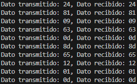

---

## Simulación del testbench

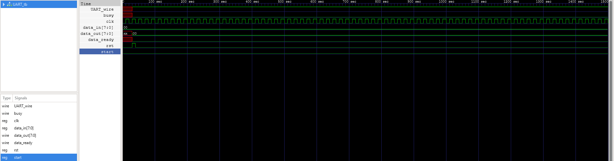

---

## Prueba en la tarjeta FPGA

[Ver video de la prueba](Practica_6_UART/UART.mp4)

---

# Práctica 7: VGA

## hvsync_generator.v

Este módulo genera las **señales de sincronización horizontal y vertical para VGA**.  
También produce los contadores de posición del pixel (`CounterX` y `CounterY`) y la señal `inDisplayArea`, que indica cuándo el pixel se encuentra dentro del área visible de la pantalla.

La resolución utilizada corresponde al estándar **640×480 a 60 Hz**.

```verilog
module hvsync_generator (

    input clk,
    input pixel_tick,

    output vga_h_sync,
    output vga_v_sync,

    output reg inDisplayArea,
    output reg [9:0] CounterX = 0,
    output reg [9:0] CounterY = 0

);

    reg vga_HS = 0;
    reg vga_VS = 0;

    wire CounterXmaxed = (CounterX == 799);
    wire CounterYmaxed = (CounterY == 524);

    always @(posedge clk)
        begin
            if (pixel_tick)
                begin
                    if (CounterXmaxed)
                        CounterX <= 0;
                    else
                        CounterX <= CounterX + 1;
                end
        end

    always @(posedge clk)
        begin
            if (pixel_tick && CounterXmaxed)
                begin
                    if (CounterYmaxed)
                        CounterY <= 0;
                    else
                        CounterY <= CounterY + 1;
                end
        end

    always @(posedge clk)
        begin
            if (pixel_tick)
                vga_HS <= (CounterX >= (640 + 16) && CounterX < (640 + 16 + 96));
        end

    always @(posedge clk)
        begin
            if (pixel_tick)
                vga_VS <= (CounterY >= (480 + 10) && CounterY < (480 + 10 + 2));
        end

    always @(posedge clk)
        begin
            if (pixel_tick)
                inDisplayArea <= (CounterX < 640) && (CounterY < 480);
        end

    assign vga_h_sync = ~vga_HS;
    assign vga_v_sync = ~vga_VS;

endmodule
```

---

## VGADemo_Colores.v

Este módulo genera un **patrón de colores simple en la pantalla VGA**.  
El valor del color se obtiene a partir de los bits más significativos del contador horizontal (`CounterX`), lo que produce **bandas verticales de diferentes colores**.

También se genera un **pixel clock de 25 MHz** a partir del reloj de 50 MHz de la FPGA utilizando un divisor simple.

```verilog
module VGADemo_Colores (

    input MAX10_CLK1_50,
    output reg [2:0] pixel,
    output hsync_out,
    output vsync_out

);

    wire inDisplayArea;
    wire [9:0] CounterX;
    wire [9:0] CounterY;

    reg pixel_tick = 0;

    always @(posedge MAX10_CLK1_50)
        pixel_tick <= ~pixel_tick;

    hvsync_generator hvsync (
        .clk(MAX10_CLK1_50),
        .pixel_tick(pixel_tick),
        .vga_h_sync(hsync_out),
        .vga_v_sync(vsync_out),
        .CounterX(CounterX),
        .CounterY(CounterY),
        .inDisplayArea(inDisplayArea)
    ); 

    always @(posedge MAX10_CLK1_50)
        begin
            if (inDisplayArea)
                pixel <= CounterX[9:6];
            else
                pixel <= 3'b000;
        end
        
endmodule
```

---

## VGADemo_Ajedrez.v

Este módulo genera un **patrón de tablero de ajedrez** en la pantalla VGA.  
El patrón se crea utilizando la operación XOR entre bits de los contadores `CounterX` y `CounterY`, lo que produce cuadros alternados blancos y negros.

Cada cuadro del tablero se genera tomando un bit específico de cada contador para dividir la pantalla en regiones.

```verilog
module VGADemo_Ajedrez (

    input MAX10_CLK1_50,

    output [3:0] vga_red,
    output [3:0] vga_green,
    output [3:0] vga_blue,

    output hsync_out,
    output vsync_out

);

    wire inDisplayArea;
    wire [9:0] CounterX;
    wire [9:0] CounterY;

    // Generador de 25 MHz
    reg pixel_tick = 0;

    always @(posedge MAX10_CLK1_50)
        begin
            pixel_tick <= ~pixel_tick;
        end

    hvsync_generator hvsync (

        .clk(MAX10_CLK1_50),
        .pixel_tick(pixel_tick),
        .vga_h_sync(hsync_out),
        .vga_v_sync(vsync_out),
        .CounterX(CounterX),
        .CounterY(CounterY),
        .inDisplayArea(inDisplayArea)

    );

    // Lógica del patrón tipo ajedrez
    wire is_white;

    assign is_white = CounterX[6] ^ CounterY[6];

    assign vga_red   = (inDisplayArea && is_white) ? 4'b1111 : 4'b0000;
    assign vga_green = (inDisplayArea && is_white) ? 4'b1111 : 4'b0000;
    assign vga_blue  = (inDisplayArea && is_white) ? 4'b1111 : 4'b0000;

endmodule
```

---

## Resultado del patrón de colores


---

## Resultado del patrón tipo ajedrez


---

# Mini Challenge 1: Debouncer

## debouncer_wr.v

Este módulo funciona como **wrapper del sistema de debouncing**.  
Conecta los botones (`KEY`), el reloj de la FPGA y los módulos internos encargados de limpiar la señal del botón, detectar el flanco de subida y contar las pulsaciones.

El valor del contador se muestra tanto en los **LEDs de la tarjeta** como en **cuatro displays de 7 segmentos**.

```verilog
module debouncer_wr (

    input MAX10_CLK1_50,
    input [1:0] KEY,
    output [9:0] LEDR,

    output [0:6] HEX0,
    output [0:6] HEX1,
    output [0:6] HEX2,
    output [0:6] HEX3

);

    wire clk;
    wire rst;
    wire boton_in;
    wire boton_limpio;
    wire pulso;

    wire [9:0] contador;

    assign clk = MAX10_CLK1_50;
    assign rst = ~KEY[1];
    assign boton_in = ~KEY[0];

    debouncer Debouncer (
        .clk(clk),
        .rst(rst),
        .boton_in(boton_in),
        .boton_out(boton_limpio)
    );

    edge_detector EdgeDetector (
        .clk(clk),
        .rst(rst),
        .boton_out(boton_limpio),
        .pulso(pulso)
    );

    counter_debouncer CounterDebouncer (
        .clk(clk),
        .rst(rst),
        .pulso(pulso),
        .leds(contador)
    );

    assign LEDR = contador;

    BCD_4Displays BCD (
        .bcd_in(contador),
        .D_un(HEX0),
        .D_de(HEX1),
        .D_ce(HEX2),
        .D_mi(HEX3)
    );

endmodule
```

---

## debouncer.v

Este módulo implementa el **debouncer**, cuya función es eliminar el rebote mecánico de los botones.  

Cuando se detecta un cambio en la entrada `boton_in`, se inicia un contador.  
Si el cambio se mantiene estable durante un tiempo determinado (`MAX_COUNT`), entonces la salida `boton_out` se actualiza.

```verilog
module debouncer (

    input  clk,
    input  rst,
    input  boton_in,
    output reg boton_out

);

    parameter MAX_COUNT = 1000000;

    reg [19:0] contador;

    always @(posedge clk or posedge rst)
        begin
            if (rst)
                begin
                        boton_out <= 0;
                        contador <= 0;
                end
            else
                begin
                        if (boton_in != boton_out)
                            begin
                                contador <= contador + 1;
                                if (contador == MAX_COUNT)
                                    begin
                                        boton_out <= boton_in;
                                        contador  <= 0;
                                    end
                            end
                        else
                            begin
                                contador <= 0;
                            end
                end
        end
endmodule
```

---

## edge_detector.v

Este módulo detecta el **flanco de subida** del botón ya debounced.  

Cuando la señal pasa de `0` a `1`, se genera un **pulso de un solo ciclo de reloj**, lo cual permite activar correctamente el contador.

```verilog
module edge_detector (

    input clk,
    input rst,
    input boton_out,
    output reg pulso

);
    reg boton_d;

    always @(posedge clk or posedge rst)
        begin
            if (rst)
                begin
                    boton_d <= 0;
                    pulso <= 0;
                end
            else
                begin
                    boton_d <= boton_out;
                    pulso <= boton_out & ~boton_d;
                end
        end
endmodule
```

---

## debouncer_tb.v

Este **testbench** verifica el funcionamiento del sistema completo.  
Simula varias presiones del botón y un reset para comprobar que el contador solo se incrementa una vez por cada pulsación limpia.

```verilog
module debouncer_tb;

    reg clk;
    reg [1:0] KEY;
    wire [9:0] LEDR;

    debouncer_wr DUT (
        .MAX10_CLK1_50(clk),
        .KEY(KEY),
        .LEDR(LEDR)
    );

    initial
        clk = 0;

    always
        #10 clk = ~clk;

    initial
    begin
        KEY = 2'b11;

        $display("Inicio de simulación");
        $monitor("Tiempo=%0t | KEY=%b | Contador=%d", $time, KEY, LEDR);

        #100;

        KEY[1] = 0;
        #21000000;
        KEY[1] = 1;
        #21000000;

        $display("Primera presión");

        KEY[0] = 0;
        #21000000;
        KEY[0] = 1;
        #21000000;

        $display("Segunda presión");

        KEY[0] = 0;
        #21000000;
        KEY[0] = 1;
        #21000000;

        $display("Reset");

        KEY[1] = 0;
        #21000000;
        KEY[1] = 1;
        #21000000;

        $display("Fin de simulación");
        $finish;
    end

    initial 
        begin
            $dumpfile("debouncer_tb.vcd");
            $dumpvars(0, debouncer_tb);
        end

endmodule
```

---

## Testbench

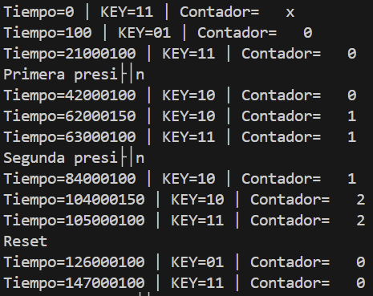
